# Release Instructions

IMPORTANT: A release will be made for all packages with changes since the last published release

## Prerequisites

* GitHub CLI, `gh`
* JSON processor, `jq`
* Have `write` access to the repository, to request a workflow

## Instructions

There are three roles, "Requestor", "Code Owner Reviewer", and "Repository Owner".

### Requestor

Run through this process when you want to cut a release.

1. (OPTIONAL) See what changes will be processed from what is in the default `main` compared to the latest published release.

    ```bash
    git pull origin
    LATEST_TAGGED_VERSION="$(gh release list --repo awslabs/mcp --limit 1 --exclude-drafts --exclude-pre-releases --json tagName | jq -r '.[0].tagName')"; git diff "${LATEST_TAGGED_VERSION}"...remotes/origin/main  --name-only
    ```

1. Run the [Release Branch (initiated)](https://github.com/awslabs/mcp/actions/workflows/release-initiate-branch.yml) GitHub Workflow:

    * Use the GitHub Web and `Run worklow` on the default `main` branch

    or

    * Run this GitHub CLI:

    ```bash
    gh workflow run --repo awslabs/mcp --ref main release-initiate-branch.yml
    ```

1. (RECOMMENDED) Set the resulting pull request to `Merge when ready`

1. Wait for merge to be unblocked and `Merge when ready`

    * code owner review approvals
    * required workflows successful
    * no merbge conflicts
    * updated branch
    * etc.

### Code Owner Reviewer

The pull request generated by the requestor, still takes two parties to approve (from `CODEOWNERS`) to ensure all packages are approved.

_NOTE: The requestor may be a valid approver due to automation cutting the release branch and pull request._

1. Review Assigned `chore: release/<YYYY.MM.YYYYMMDDhhmmss>` Pull Requests

    * `Approve`
    * `Comment`
    * `Request changes`
    * abstain - unless you are a blocker

### Repository Owner

A successful merge will start a release, and requires approval for the deployment.

_NOTE: The requestor and code owners may be valid due to automation tagging the default branch._

1. Approve or Reject [Release Deploy (approvals)](https://github.com/awslabs/mcp/actions/workflows/release.yml) Deployment Requests

    or run some GitHub CLI commands:

    ```shell
    $ gh run list --workflow=release.yml --branch <YYYY.MM.YYYYMMDDhhmmss> --status waiting --json databaseId | jq '.[].databaseId'

    <UNIQUE_NUMBER>

    # Review the Run
    $ gh api \
        --method POST \
        -H "Accept: application/vnd.github+json" \
        -H "X-GitHub-Api-Version: 2022-11-28" \
        /repos/awslabs/mcp/actions/runs/<UNIQUE_NUMBER>/pending_deployments -F "environment_ids[]=$(gh api --method GET -H "Accept: application/vnd.github+json" -H "X-GitHub-Api-Version: 2022-11-28" /repos/awslabs/mcp/environments | jq '.environments[] | select (.name == "release") | .id')" -f "state=approved" -f "comment=release"
    ```

## Workflow

Here is a diagram of the flow:

```mermaid
flowchart TD
    A((👤 Manual Trigger<br/>workflow_dispatch)) --> B["🔍 <a href="https://github.com/awslabs/mcp/actions/workflows/release-initiate-branch.yml">Release Branch</a><br/>Find changed directories<br/>since last release"]

    B --> C{Changes<br/>detected?}
    C -->|No| D((❌ End - No changes))
    C -->|Yes| E["🌿 Create release branch<br/><i>release/YYYY.MM.YYYYMMDDHHIISS</i>"]

    E --> F[📦 Bump package versions<br/>in changed directories]
    F --> G[📝 Create Pull Request<br/>to main branch]

    G --> H{👤 PR merged<br/>to main?}
    H -->|No| I(("⏳ Wait for PR review<br />or PR <b>Closed</b>"))


    H -->|Yes| J["🏷️ <a href="https://github.com/awslabs/mcp/actions/workflows/release-merge-tag.yml">Release Merged</a><br/>Create & push signed tag<br/><i>YYYY.MM.YYYYMMDDHHIISS</i>"]

    J --> K[🚀 <a href="https://github.com/awslabs/mcp/actions/workflows/release.yml">Release Deploy</a><br/>Draft GitHub release]
    K --> L[🔍 Find changed packages<br/>Python/Node/Docker]

    L --> M{Packages to<br/>publish?}
    M -->|No| N((📋 Publish final release<br />No packages))
    M -->|Yes| O[👤 Wait for approval<br/>Protected environment]

    O --> P{Approved?}
    P -->|No| Q((❌ Release rejected))
    P -->|Yes| R[📦 Build & publish packages<br/>PyPI, NPM, Docker ECR]

    R --> S{Build<br/>successful?}
    S -->|No| T((❌ Release failed))
    S -->|Yes| U((✅ Publish final release<br/>GitHub Release))

    %% Styling
    classDef manual fill:#e1f5fe,stroke:#01579b,stroke-width:2px
    classDef automated fill:#f3e5f5,stroke:#4a148c,stroke-width:2px
    classDef decision fill:#fff3e0,stroke:#e65100,stroke-width:2px
    classDef success fill:#e8f5e8,stroke:#2e7d32,stroke-width:2px
    classDef failure fill:#ffebee,stroke:#c62828,stroke-width:2px

    class A,H,O manual
    class B,E,F,G,J,K,L,R automated
    class C,M,P,S decision
    class N,U success
    class D,I,Q,T failure
```


