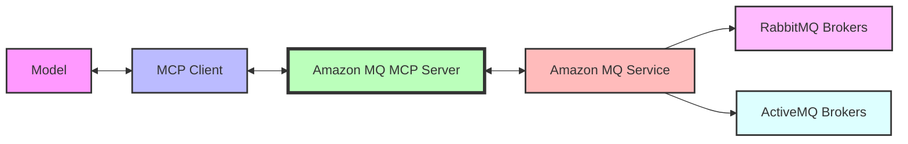

# Amazon MQ MCP Server

A Model Context Protocol (MCP) server for Amazon MQ that enables generative AI models to manage RabbitMQ and ActiveMQ message brokers through MCP tools.

## Features

This MCP server acts as a **bridge** between MCP clients and Amazon MQ, allowing generative AI models to create, configure, and manage message brokers. The server provides a secure way to interact with Amazon MQ resources while maintaining proper access controls and resource tagging.



From a **security** perspective, this server implements resource tagging to ensure that only resources created through the MCP server can be modified by it. This prevents unauthorized modifications to existing Amazon MQ resources that were not created by the MCP server.

## Key Capabilities

- Create and manage Amazon MQ brokers (RabbitMQ and ActiveMQ)
- Configure broker settings and parameters
- List and describe existing brokers
- Reboot and update brokers
- Create and manage broker configurations
- Automatic resource tagging for security

## Prerequisites

1. Install `uv` from [Astral](https://docs.astral.sh/uv/getting-started/installation/) or the [GitHub README](https://github.com/astral-sh/uv#installation)
2. Install Python using `uv python install 3.10`
3. AWS account with permissions to create and manage Amazon MQ resources

## Setup

### IAM Configuration

The authorization between AmazonMQ MCP server and your AWS accounts are performed with AWS profile you setup on the host. There are several ways to setup a AWS profile, however we recommend creating a new IAM role that has `AmazonMQReadOnlyAccess` permission following the principle of "least privilege". Note, if you want to use tools that mutate your tagged resources, you need to grant `AmazonMQFullAccess`. Finally, configure a AWS profile on the host that assumes the new role (for more information, check out the [AWS CLI help page](https://docs.aws.amazon.com/cli/v1/userguide/cli-configure-role.html)).

### Installation

| Cursor | VS Code |
|:------:|:-------:|
| [](https://cursor.com/en/install-mcp?name=awslabs.amazon-mq-mcp-server&config=eyJjb21tYW5kIjoidXZ4IGF3c2xhYnMuYW1hem9uLW1xLW1jcC1zZXJ2ZXJAbGF0ZXN0IiwiZW52Ijp7IkFXU19QUk9GSUxFIjoieW91ci1hd3MtcHJvZmlsZSIsIkFXU19SRUdJT04iOiJ1cy1lYXN0LTEiLCJGQVNUTUNQX0xPR19MRVZFTCI6IkVSUk9SIn0sImRpc2FibGVkIjpmYWxzZSwiYXV0b0FwcHJvdmUiOltdfQ%3D%3D) | [](https://insiders.vscode.dev/redirect/mcp/install?name=Amazon%20MQ%20MCP%20Server&config=%7B%22command%22%3A%22uvx%22%2C%22args%22%3A%5B%22awslabs.amazon-mq-mcp-server%40latest%22%5D%2C%22env%22%3A%7B%22AWS_PROFILE%22%3A%22your-aws-profile%22%2C%22AWS_REGION%22%3A%22us-east-1%22%2C%22FASTMCP_LOG_LEVEL%22%3A%22ERROR%22%7D%2C%22disabled%22%3Afalse%2C%22autoApprove%22%3A%5B%5D%7D) |

#### Amazon Q Developer

Configure the MCP server in your MCP client configuration (e.g., for Amazon Q Developer CLI, edit `~/.aws/amazonq/mcp.json`):

```json
{
  "mcpServers": {
    "awslabs.amazon-mq-mcp-server": {
      "command": "uvx",
      "args": ["awslabs.amazon-mq-mcp-server@latest"],
      "env": {
        "AWS_PROFILE": "your-aws-profile",
        "AWS_REGION": "us-east-1"
      }
    }
  }
}
```
### Windows Installation

For Windows users, the MCP server configuration format is slightly different:

```json
{
  "mcpServers": {
    "awslabs.amazon-mq-mcp-server": {
      "disabled": false,
      "timeout": 60,
      "type": "stdio",
      "command": "uv",
      "args": [
        "tool",
        "run",
        "--from",
        "awslabs.amazon-mq-mcp-server@latest",
        "awslabs.amazon-mq-mcp-server.exe"
      ],
      "env": {
        "FASTMCP_LOG_LEVEL": "ERROR",
        "AWS_PROFILE": "your-aws-profile",
        "AWS_REGION": "us-east-1"
      }
    }
  }
}
```


If you would like to specify a flag (for example, to allow creation of resources), you can pass it to the args

```json
{
  "mcpServers": {
    "awslabs.amazon-mq-mcp-server": {
      "command": "uvx",
      "args": ["awslabs.amazon-mq-mcp-server@latest", "--allow-resource-creation"],
      "env": {
        "AWS_PROFILE": "your-aws-profile",
        "AWS_REGION": "us-east-1"
      }
    }
  }
}
```

#### Docker
First build the image `docker build -t awslabs/amazon-mq-mcp-server .`:

```file
# fictitious `.env` file with AWS temporary credentials
AWS_ACCESS_KEY_ID=<from the profile you set up>
AWS_SECRET_ACCESS_KEY=<from the profile you set up>
AWS_SESSION_TOKEN=<from the profile you set up>
```

```json
  {
    "mcpServers": {
      "awslabs.amazon-mq-mcp-server": {
        "command": "docker",
        "args": [
          "run",
          "--rm",
          "--interactive",
          "--env-file",
          "/full/path/to/file/above/.env",
          "awslabs/amazon-mq-mcp-server:latest"
        ],
        "env": {},
        "disabled": false,
        "autoApprove": []
      }
    }
  }
```

You can also pull the public ECR image at public.ecr.aws/awslabs-mcp/awslabs/amazon-mq-mcp-server:latest

#### Kiro

At the project level `.kiro/settings/mcp.json`

```
{
  "mcpServers": {
    "awslabs.amazon-mq-mcp-server": {
      "command": "uvx",
      "args": ["awslabs.amazon-mq-mcp-server@latest"],
      "env": {
        "AWS_PROFILE": "your-aws-profile",
        "AWS_REGION": "us-east-1"
      }
    }
  }
}
```

#### Claude Desktop

```json
{
  "mcpServers": {
    "awslabs.amazon-mq-mcp-server": {
      "command": "uvx",
      "args": ["awslabs.amazon-mq-mcp-server@latest"],
      "env": {
        "AWS_PROFILE": "your-aws-profile",
        "AWS_REGION": "us-east-1"
      }
    }
  }
}
```

## Server Configuration Options

The Amazon MQ MCP Server supports several command-line arguments that can be used to configure its behavior:

### `--allow-resource-creation`

Allow tools that create resources in the user's AWS account. When this flag is enabled, the `create_broker` and `create_configuration` tools will be created for the MCP client, preventing the creation of new Amazon MQ resources. Default is False.

This flag is particularly useful for:
- Testing environments where resource creation should be restricted
- Limiting the scope of actions available to the AI model

Example:
```bash
uv run awslabs.amazon-mq-mcp-server --allow-resource-creation
```

### Security Features

The MCP server implements a security mechanism that only allows modification of resources that were created by the MCP server itself. This is achieved by:

1. Automatically tagging all created resources with a `mcp_server_version` tag
2. Validating this tag before allowing any mutative actions (update, delete, reboot)
3. Rejecting operations on resources that don't have the appropriate tag

## Best Practices

- Use descriptive broker names to easily identify resources
- Follow the principle of least privilege when setting up IAM permissions
- Use separate AWS profiles for different environments (dev, test, prod)
- Monitor broker metrics and logs for performance and issues
- Implement proper error handling in your client applications

## Security Considerations

When using this MCP server, consider:

- The MCP server needs permissions to create and manage Amazon MQ resources
- Only resources created by the MCP server can be modified by it
- Ensure proper network security for your brokers (use `publicly_accessible: false` when possible)
- Implement strong authentication for broker users
- Review and rotate credentials regularly

## Troubleshooting

- If you encounter permission errors, verify your IAM user has the correct policies attached
- For connection issues, check network configurations and security groups
- If resource modification fails with a tag validation error, it means the resource was not created by the MCP server
- For general Amazon MQ issues, consult the [Amazon MQ documentation](https://docs.aws.amazon.com/amazon-mq/)
